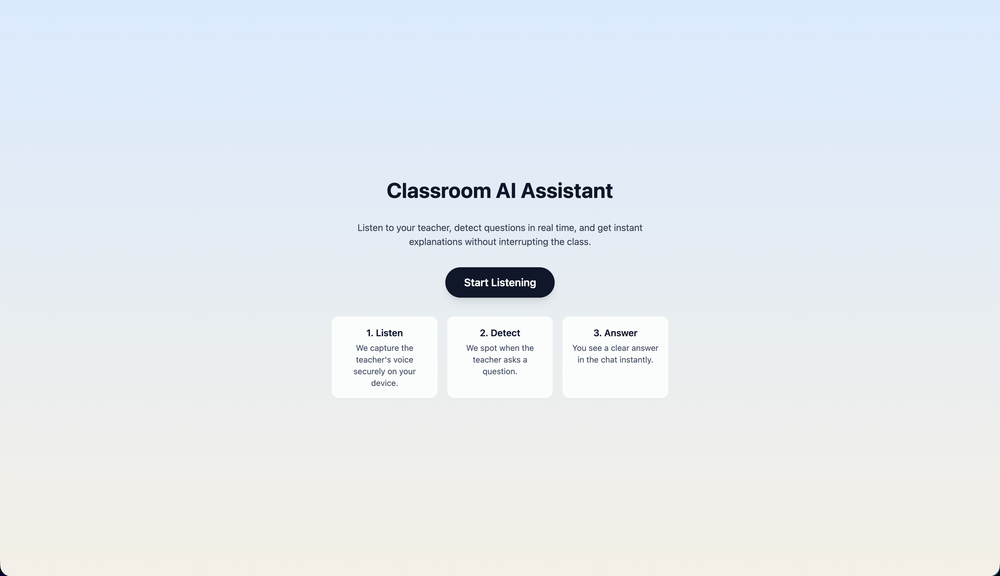
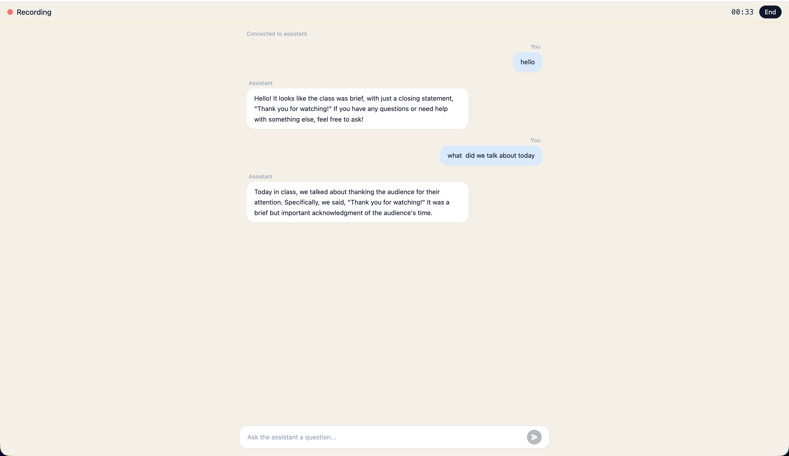

# Classroom AI Assistant

A real-time classroom companion that listens to your teacher, detects questions, and provides instant AI-powered answers — all without interrupting the lecture.

**[Try it live](https://classroom-assistant-qfla.onrender.com/)**



## Features

- **Live Transcription** — Captures and transcribes the teacher's voice in real time using OpenAI Whisper.
- **Automatic Question Detection** — Scans the transcript every 5 seconds to identify questions the teacher asks.
- **AI-Powered Answers** — Generates concise answers using the class transcript as context, powered by Google Gemini with OpenAI GPT-4o-mini fallback.
- **Student Chat** — Students can ask their own questions at any time and get answers grounded in what was actually discussed in class.
- **Noise Filtering** — Automatically filters out common filler phrases and YouTube-style artifacts from transcription.


## How It Works

1. **Start Listening** — Click the button, grant microphone access, and the assistant begins capturing audio.
2. **Transcription** — Audio is streamed to the server in 5-second chunks, transcribed by Whisper, and accumulated into a running transcript.
3. **Question Detection** — Every 5 seconds, new transcript text is scanned for questions (regex + keyword heuristics).
4. **Answer Generation** — Detected questions are answered using the full transcript as context. The LLM prioritizes transcript content before using its own knowledge.
5. **Student Q&A** — Students type questions in the chat. The assistant answers using the accumulated transcript.



## Tech Stack

| Layer | Technology |
|-------|-----------|
| Frontend | React 18, Vite, Tailwind CSS |
| Backend | Node.js, Express, Socket.IO |
| Transcription | OpenAI Whisper API |
| LLM | Google Gemini 1.5 Flash (primary), OpenAI GPT-4o-mini (fallback) |
| Deployment | Render.com |

## Architecture

```
Browser (React)
  │
  ├── MediaRecorder captures mic audio (WebM/Opus)
  ├── Socket.IO streams chunks to server
  └── Displays transcript, questions & answers
  
Server (Node.js/Express)
  │
  ├── Whisper API transcribes each audio chunk
  ├── Accumulates per-session transcript
  ├── Periodic question detection (every 5s)
  ├── Gemini/OpenAI answers questions with transcript context
  └── Serves React build in production
```

## Getting Started

### Prerequisites

- Node.js 18+
- OpenAI API key
- Google Gemini API key (optional, falls back to OpenAI)

### Setup

```bash
# Clone the repo
git clone https://github.com/MateDort/DoNotUseThis.git
cd DoNotUseThis

# Create your .env file
cp .env.example .env
# Edit .env and add your API keys

# Install and start the server
cd server
npm install
npm run dev

# In a separate terminal, install and start the client
cd client/client
npm install
npm run dev
```

The client runs at `http://localhost:5173` and proxies API/WebSocket requests to the server on port `4000`.

### Environment Variables

| Variable | Required | Description |
|----------|----------|-------------|
| `OPENAI_API_KEY` | Yes | OpenAI API key for Whisper transcription and GPT fallback |
| `GOOGLE_GEMINI_API_KEY` | No | Google Gemini API key (primary LLM, falls back to OpenAI) |
| `PORT` | No | Server port (default: 4000) |

## Deployment

The app is deployed on [Render.com](https://render.com) as a single web service. The Node.js server serves the built React client in production.

```bash
# Build command
npm run build    # Builds the React client

# Start command
npm run start    # Starts the Express server (serves static files + WebSocket)
```

A `render.yaml` is included for one-click deployment via Render Blueprint.

## License

MIT
